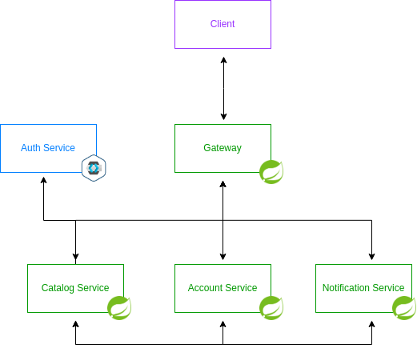

<div style="font-size:0;" align="center">
    
</div>

<p align="center">Veqflix is a full streaming platform backend written with Spring</p>

<p align="center">
<!-- Spring boot version -->
<a href="https://github.com/spring-projects/spring-boot/releases/tag/v2.7.4">
    
</a>
<!-- Spring cloud version -->
<a href="https://github.com/spring-cloud/spring-cloud-release/wiki/Spring-Cloud-2021.0-Release-Notes#202104">
    
</a>
</p>

<p align="center">
<!-- Google code style -->
<a href="https://google.github.io/styleguide/javaguide.html">
    
</a>
<!-- License -->
<a href="https://de.wikipedia.org/wiki/MIT-Lizenz">
    
</a>
</p>

## Introduction
> The project is intended as demonstration and should be used in production.
> The project is not yet complete and is still under development.

Inspirations for the project were [Netflix](https://netflix.com) and [Amazon Prime Video](https://primevideo.com).

This project is a backend for a streaming platform. It is written in Java 17 with the [Spring framework](https://spring.io/).
The project is divided into several microservices witch communicate with each other via REST or [RabbitMQ](https://www.rabbitmq.com/).
The services only contain data and not files such as videos or images.

**Streams vs Loops**
In this project I used streams preferentially. Streams are more readable and easier to understand.
However, if you like to have the best performance, you can use loops instead.

**Service Discovery**
There are many products for service discovery such as [Netflix Eureka](https://github.com/Netflix/eureka), [Spring Cloud Kubernetes](https://spring.io/projects/spring-cloud-kubernetes), [Consul](https://www.consul.io/) and more.
Since we already run a [Kubernetes](https://kubernetes.io/) cluster, we use [Spring Cloud Kubernetes](https://spring.io/projects/spring-cloud-kubernetes) for service discovery.

**Authentication and Authorization**
For authentication and authorization, [Keycloak](https://www.keycloak.org/) is used. Keycloak is an open source identity and access management solution.

**Caching**
The [Movie Service](./movie-service/README.md) and [Series Service](./series-service/README.md) are using [Spring Cache](https://spring.io/projects/spring-cache) to cache the content if needed.

**Database**
The database is a [PostgreSQL](https://www.postgresql.org/) database. The database is running in a [Kubernetes](https://kubernetes.io/) cluster for development and testing.

## Architecture
To provide a highly maintainable and testable code, the architecture is based of the [microservice architecture pattern](https://microservices.io/patterns/microservices.html).
<div style="font-size:0;" align="center">
    
</div>

### [Gateway Service](./gateway-service/README.md)
The gateway is the entry point for all requests. It is responsible for routing the requests to the correct microservice.
The gateway is implemented with [Spring Cloud Gateway](https://spring.io/projects/spring-cloud-gateway).

### [Account Service](./account-service/README.md)
The account service is responsible for managing user accounts.

### [Movie Service](./movie-service/README.md)
The movie service is responsible for managing movies.

### [Series Service](./series-service/README.md)
The series service is responsible for managing series.

### [Notification Service](./notification-service/README.md)
The notification service is responsible for sending notifications to users.

## Getting started

### Prerequisites
- [Maven](https://maven.apache.org/)
- [Git](https://git-scm.com/)
- [Docker](https://docs.docker.com/get-docker/)
- [Kubernetes](https://kubernetes.io/docs/setup/) or [Minikube](https://minikube.sigs.k8s.io/docs/start/)

To start the application in Kubernetes, you need to clone the repository and start the Kubernetes deployment.
```shell
git clone
cd veqflix
kubectl apply -f k8s
```

## Future Plans

### Media Service
The media service is responsible for managing media files such as profile pictures, movie posters, movie trailers, etc.
But instead of storing the media files in the database, the media service stores the media files in a cloud storage such as [AWS](https://aws.amazon.com/de/free/?trk=c25dd0aa-ac63-4039-9735-8633c6c683f6&sc_channel=ps&s_kwcid=AL!4422!3!560181736076!e!!g!!aws&ef_id=Cj0KCQjwqoibBhDUARIsAH2OpWjEDYIqXtSvnh56LKhq3SYFeO8N09grx52O9k3MgJ-dFG-GEyzNqOcaAmyHEALw_wcB:G:s&s_kwcid=AL!4422!3!560181736076!e!!g!!aws) or [Azure](https://azure.microsoft.com/de-de/free/search/?&ef_id=Cj0KCQjwqoibBhDUARIsAH2OpWgCG9kIf25Od8Fs0Z2Dw8sTgTuLzB0nqnY2vKcKKxN11uYiAJR6qnkaAmS6EALw_wcB:G:s&OCID=AIDcmmxroep22q_SEM_Cj0KCQjwqoibBhDUARIsAH2OpWgCG9kIf25Od8Fs0Z2Dw8sTgTuLzB0nqnY2vKcKKxN11uYiAJR6qnkaAmS6EALw_wcB:G:s&gclid=Cj0KCQjwqoibBhDUARIsAH2OpWgCG9kIf25Od8Fs0Z2Dw8sTgTuLzB0nqnY2vKcKKxN11uYiAJR6qnkaAmS6EALw_wcB).

### Angular Frontend
The frontend for veqflix implemented with [Angular](https://angular.io/).

---

## Acknowledgments
- [Spring](https://spring.io/)
- [Spring Cloud](https://spring.io/projects/spring-cloud)
- [Spring Cloud Gateway](https://spring.io/projects/spring-cloud-gateway)
- [Spring Authorization Server](https://spring.io/projects/spring-authorization-server)
- [Spring Cloud Kubernetes](https://spring.io/projects/spring-cloud-kubernetes)
- [Spring Cloud Sleuth](https://spring.io/projects/spring-cloud-sleuth)
- [Spring Cloud OpenFeign](https://spring.io/projects/spring-cloud-openfeign)
- [Spring Cloud Security](https://spring.io/projects/spring-cloud-security)

## License
This project is licensed under the MIT License - see the [LICENSE](LICENSE) file for details